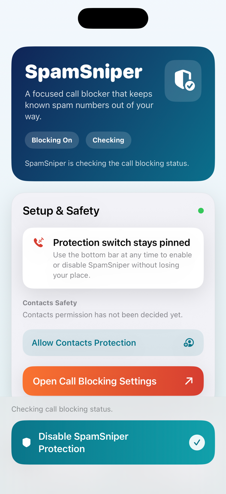

# SpamSniper

SpamSniper is an iPhone call-blocking app that syncs curated spam blocklists, stores them in a shared local database, merges them with your personal blocked numbers, and feeds the final result into an iOS Call Directory extension for system-level blocking. It is designed to stay lightweight, repo-driven, and practical: choose blocklists, add your own numbers when needed, and let iOS handle matching calls.



## Features

- Syncs spam blocklists from a repository-backed catalog.
- Remembers blocklist selections separately for each repository you activate.
- Merges personal blocked numbers into the same final blocking feed used by the extension.
- Stores blocklist data in a shared SQLite database.
- Supports multiple blocklist selections.
- Collapses duplicate repo + personal numbers into one final blocked entry.
- Excludes saved contacts from blocking when Contacts access is granted.
- Uses an iOS Call Directory extension for system-level blocking.
- Verifies blocklist signatures before import.

## Project Structure

- `SpamSniper/SpamSniper.xcodeproj`: Main Xcode project.
- `SpamSniper/SpamSniper/`: iOS app target.
- `SpamSniper/SpamSniperCallBlocker/`: Call Directory extension target.
- `SpamSniper/Shared/`: Shared models, sync logic, database code, and signature verification.
- `blocklist/`: Repository-backed blocklist data and metadata.
- `docs/`: Project documentation, including support and privacy details.

## Requirements

- macOS with Xcode 26.3 or newer.
- iOS Simulator or a physical iPhone for app builds.
- A physical iPhone is required to fully test Call Directory extension behavior.

## Build

### Open in Xcode

1. Open [SpamSniper.xcodeproj](SpamSniper/SpamSniper.xcodeproj) in Xcode.
2. Select the `SpamSniper` scheme.
3. Build and run the app.

### Command Line Build

Build for a generic iOS Simulator destination:

```sh
xcodebuild -project SpamSniper/SpamSniper.xcodeproj \
  -scheme SpamSniper \
  -configuration Debug \
  -destination 'generic/platform=iOS Simulator' \
  build
```

## Usage Notes

- The app can be explored in Simulator, but Call Directory status and blocking behavior should be validated on a real iPhone.
- The app fetches repository metadata and blocklists, verifies signatures, refreshes the shared local database, and then merges synced numbers with personal entries before reloading the extension.
- Each repository keeps its own saved blocklist selections, so switching sources restores the last valid selection set for that repository.
- If Contacts permission is enabled, SpamSniper avoids blocking numbers already saved in the user’s contacts during repository sync imports. Personal entries are always honored because you added them intentionally.
- Repository metadata and downloaded blocklist files are signature-verified before import. Personal entries are local user data, so they are not part of the signature-verification flow.

## How Blocking Data Is Composed

- Selected repository blocklists provide the synced shared database snapshot.
- Repository selection state is stored per repository identity, so switching sources does not overwrite another repository’s saved choices.
- Personal blocklist entries are merged into that snapshot on-device.
- When the same phone number exists in both places, SpamSniper keeps one final blocked number and uses the personal notes/tags to enrich in-app search results.
- Contacts already saved on the device are excluded from repository sync imports when Contacts access is granted. Personal entries remain active because they are explicit user choices.
- Signature verification applies to repository metadata and downloaded blocklist files only; personal entries are local data and are not signed.
- The Call Directory extension consumes only the final deduplicated phone-number set.

## License

SpamSniper is licensed under the MIT License. See [LICENSE](LICENSE).

## Third-Party License Notice

This project depends on ObjectivePGP by Marcin Krzyzanowski for OpenPGP signature verification. ObjectivePGP is licensed separately and is not covered by SpamSniper's MIT License. Review the upstream ObjectivePGP `LICENSE.txt` and `LICENSE-third-party.txt` files before redistribution or commercial use.

## Contribution

Contributions are welcome, but changes should preserve the current goals of the app:

- Keep the app lightweight and focused on call blocking.
- Prefer clear, auditable data flows for blocklist sync and verification.
- Avoid breaking the shared app group, shared database, or Call Directory extension behavior.
- Test app changes in Xcode and validate extension-related changes on device when relevant.

Recommended contribution flow:

1. Fork the repository.
2. Create a feature branch.
3. Make focused changes.
4. Build the project and verify behavior.
5. Open a pull request with a concise description of the change.
